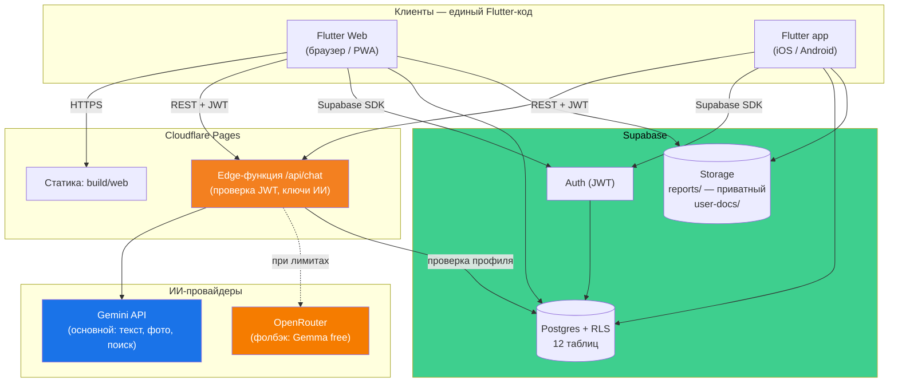
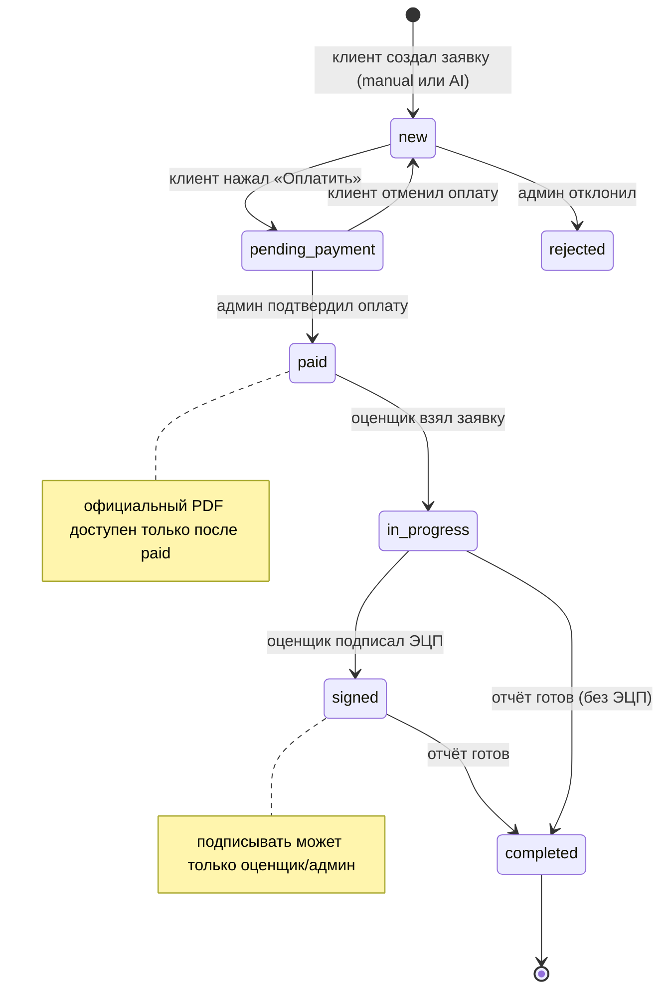
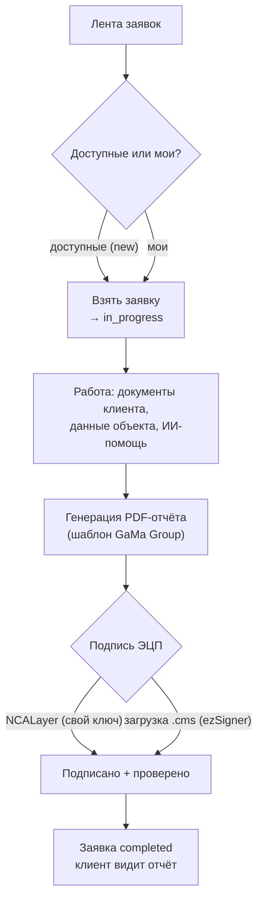
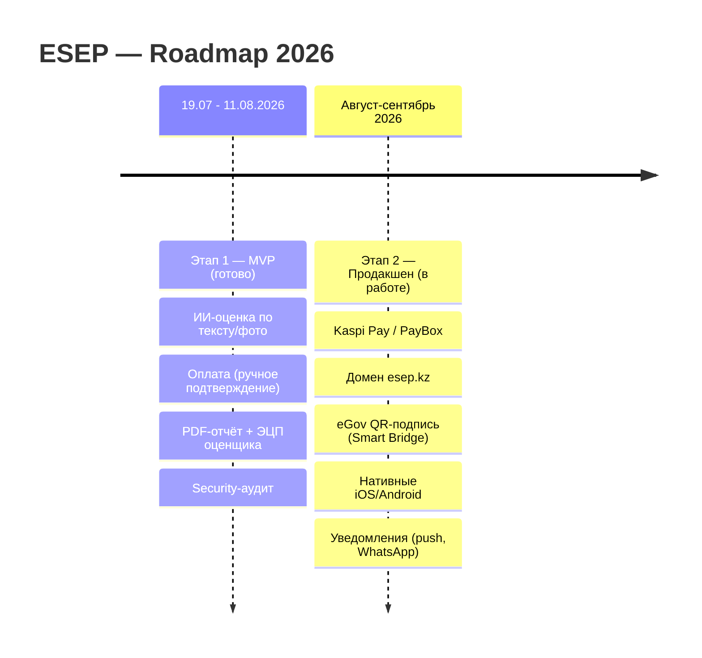
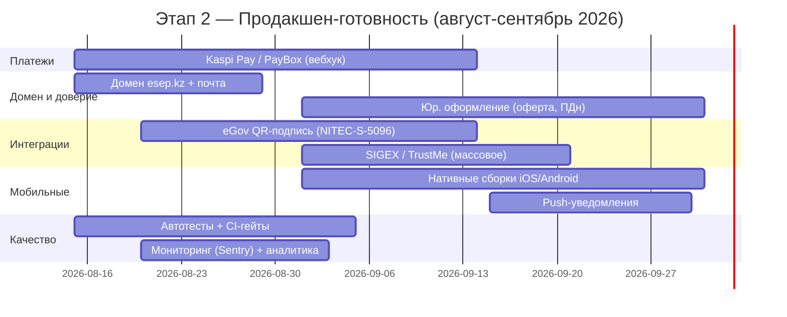
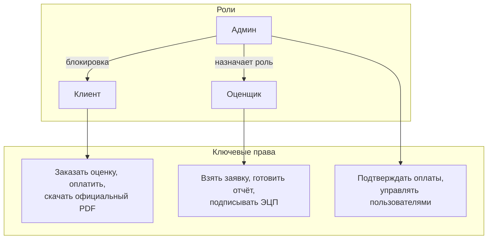

# ESEP — Roadmap и архитектура (графы)

> Графическая версия роадмапа. Текстовые версии: [Roadmap.txt](Roadmap.txt), финансы — [Tools.txt](Tools.txt).
> Диаграммы в формате Mermaid — GitHub рендерит их автоматически (вкладка на странице файла).

---

## 1. Архитектура системы

---

## 2. Путь клиента (пользовательский сценарий)

```mermaid
flowchart LR
    A["1. Регистрация<br/>email + пароль"] --> B["2. Онбординг<br/>(5 шагов-экскурсия)"]
    B --> C["3. Профиль<br/>ФИО + ИИН/БИН<br/>(1 ИИН = 1 аккаунт)"]
    C --> D["4. ИИ-чат<br/>описание текстом или фото"]
    D --> E["5. Оценка стоимости<br/>±10-15% #91;ESTIMATE#93;"]
    E --> F["6. Оплата<br/>15 000 ₸ (Kaspi / перевод)"]
    F --> G["7. Оценщик работает<br/>статус in_progress"]
    G --> H["8. Предпросмотр PDF<br/>с водяным знаком"]
    H --> I["9. ЭЦП-подпись оценщика<br/>(NCALayer / .cms)"]
    I --> J["10. Скачивание<br/>официального отчёта"]

    style F fill:#22c55e,color:#fff
    style I fill:#1a73e8,color:#fff
    style J fill:#16a34a,color:#fff
```

---

## 3. Жизненный цикл заявки (state diagram)

---

## 4. Путь оценщика

---

## 5. Этапы продукта (timeline)

---

## 6. План работ Этапа 2 (gantt)

---

## 7. Роли и доступы

---

*Сгенерировано 11.08.2026. Файлы: [Roadmap.txt](Roadmap.txt) (текст), [Tools.txt](Tools.txt) (финансы и инструменты).*
